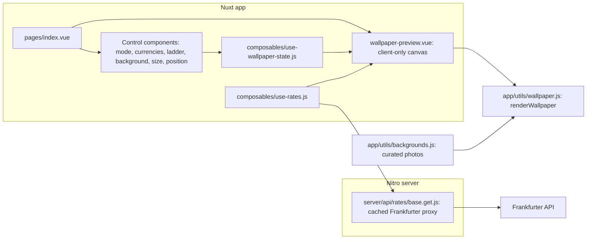

# Technical plan


## Guiding principle

Rebuild the prototype on [Nuxt](https://nuxt.com/), the full-stack Vue framework, while keeping the product unchanged.
The wallpaper is still painted on a `<canvas>` at full device resolution and exported to PNG.
The pure renderer and the data logic carry over almost verbatim; Nuxt replaces the hand-wired DOM code with components, composables, and a server-backed data layer.
The three product pillars stay the same: photo backgrounds, increment-table mode, and table positioning.

Target Nuxt 4 (v4.4.x is the current stable at the time of writing; use the latest stable Nuxt 4 release at implementation time). The repo already requires Node >= 24 and pnpm, which satisfies Nuxt's requirements.


## Why Nuxt

* Components and composables replace the manual `getElementById` wiring in `src/scripts/app.js`, so each control (mode toggle, background picker, ladder inputs) becomes a small, testable unit.
* Nitro server routes give the app a real backend: `/api/rates/[base]` proxies the Frankfurter API with built-in response caching, instead of an in-memory `Map` in the browser.
* Auto-imports cover components, composables, and utils, so modules stay small without import boilerplate.
* Hybrid rendering: the control panel shell is server-rendered for a fast first paint, while the canvas preview runs client-only where the DOM exists.
* Deployment stays flexible: Nitro presets target Node, Cloudflare, Vercel, and Netlify, and `nuxt generate` can still produce a static export for GitHub Pages.
* The `@vueuse/nuxt` module provides `useLocalStorage` for settings persistence, replacing the manual `loadState` and `saveState` helpers.
* The `@nuxtjs/i18n` module (built on Vue I18n) gives the app an English and Japanese interface with browser-language detection and a persisted language choice.


## Current architecture

The repo ships a working static prototype:

* `index.html`: the control panel plus a `<canvas id="preview">` and a download button.
* `src/scripts/app.js`: application state, localStorage persistence, dropdown population, and event wiring.
* `src/scripts/wallpaper.js`: the pure canvas renderer. Exports `renderWallpaper(canvas, data, size)`, `THEMES` (gradient palettes), and `DEVICE_SIZES` (iPhone resolutions). Currently draws a gradient background and multi-destination cards.
* `src/scripts/api.js`: a thin client for the keyless, CORS-enabled Frankfurter rate API, with an in-memory cache keyed by base currency.
* `src/data/currencies.js`: static currency metadata (`CURRENCIES`), `currencyMeta`, and `formatAmount`.
* `src/styles/styles.css`: the control panel and preview styling.

Data flow today: `app.js` loads rates via `api.js`, builds a data object, and calls `renderWallpaper` in `wallpaper.js`, which paints the canvas at full iPhone resolution. The same canvas is CSS-scaled for the preview and exported to PNG on download.


## Target architecture




## Project structure

Nuxt 4 uses `app/` as the application source directory, `server/` for Nitro code, and `shared/` for code used by both. The migration maps the current files as follows:

| Current file               | New location                                          | Notes                                       |
| -------------------------- | ----------------------------------------------------- | ------------------------------------------- |
| `index.html`               | `app/app.vue` + `app/pages/index.vue` + components    | Nuxt generates the HTML document.           |
| `src/scripts/app.js`       | `app/composables/use-wallpaper-state.js` + components | State, persistence, and wiring split apart. |
| `src/scripts/api.js`       | `server/api/rates/[base].get.js` + `use-rates.js`     | Fetch and cache move to the server.         |
| `src/scripts/wallpaper.js` | `app/utils/wallpaper.js`                              | Pure renderer, unchanged logic.             |
| `src/data/currencies.js`   | `shared/utils/currencies.js`                          | Shared by the app and the server route.     |
| `src/styles/styles.css`    | `app/assets/css/main.css`                             | Registered via `css` in `nuxt.config.ts`.   |
| `public/`                  | `public/`                                             | Unchanged.                                  |

Component and composable file names stay `lowercase-with-dashes` per the repository naming rule; Nuxt auto-imports `control-panel.vue` as `<ControlPanel>`.

Application modules stay plain JavaScript to keep the migration diff small. Nuxt supports this without extra configuration, and TypeScript can be adopted later file by file.


## Rendering strategy

* The app is a single page. `app/pages/index.vue` is server-rendered so the control panel appears immediately.
* The canvas preview lives in `app/components/wallpaper-preview.vue` wrapped in `<ClientOnly>`, because canvas drawing, `localStorage`, and PNG export require the browser.
* `routeRules` in `nuxt.config.ts` prerenders `/` and applies stale-while-revalidate caching to `/api/rates/**`.
* Static export escape hatch: `use-rates.js` falls back to calling Frankfurter directly from the browser when the rates route fails (see the data layer section for the mechanism), so `nuxt generate` output still works on a static host. The API stays keyless and CORS-enabled, so this fallback costs nothing.


## New state shape

State moves from module-level variables in `app.js` into a `useWallpaperState` composable, persisted with `useLocalStorage` under the existing `STORAGE_KEY` (`ome-currency-converter:v1`). The defaults extend the current shape with the new feature fields:

```js
// app/composables/use-wallpaper-state.js
export const defaultState = {
  base: "USD",
  destinations: ["JPY", "EUR", "THB"],
  referenceAmount: 100,
  theme: "midnight",
  device: "pro-max",
  title: "Travel rates",
  // new
  mode: "cards",           // "cards" | "table"
  travelCurrency: "JPY",   // used in table mode
  step: 5,                 // ladder step
  rowCount: 5,             // number of ladder rows
  includeOne: true,        // prepend a 1-unit row
  backgroundId: null,      // id into backgrounds.js, or null for gradient
  position: "center",      // "center" | "left"
};
```

`useLocalStorage` is configured with `mergeDefaults: true`, so older saved state stays compatible because missing fields fall back to defaults, exactly as the current `loadState` merge does.

The default mode is `cards` until the increment table renderer ships. Phase 2 flips the default to `table` so a new user lands on the ladder layout, while a returning user keeps whatever mode their saved state holds.

The interface language is not part of this state; `@nuxtjs/i18n` persists the language choice in its own cookie.


## Ladder logic

Generate the amount ladder from `step`, `rowCount`, and `includeOne`:

```js
// shared/utils/ladder.js
export function buildLadder({ step, rowCount, includeOne }) {
  const rows = [];
  if (includeOne) rows.push(1);
  for (let i = 1; rows.length < rowCount; i++) {
    const value = step * i;
    if (!rows.includes(value)) rows.push(value);
  }
  return rows;
}
// step 5, rowCount 5, includeOne true  ->  [1, 5, 10, 15, 20]
// step 1, rowCount 5, includeOne true  ->  [1, 2, 3, 4, 5] (the duplicate 1 is skipped)
// step 5, rowCount 5, includeOne false ->  [5, 10, 15, 20, 25]
```

Input constraints: `step` is an integer with a minimum of 1, and `rowCount` is an integer clamped to the range 3 to 10 so the ladder always fits the canvas. The UI inputs enforce these bounds, and `buildLadder` clamps its inputs again so the function stays safe when called directly.

The rough sketch used 1, 5, 10, 15, 25, which is not a uniform step. The configurable model is preferred; a traveler who wants that exact set can be supported later with a free-form amounts input, but the default is the uniform ladder above.

Placing `buildLadder` in `shared/utils/` keeps it a pure function that unit tests can import without booting Nuxt.


## Data layer


### `server/api/rates/[base].get.js`

* A Nitro route that proxies `https://api.frankfurter.dev/v1/latest?base=<base>` and returns `{ base, date, rates }`.
* Wrapped in `defineCachedEventHandler` with a one-hour `maxAge` and `staleWhileRevalidate`, since ECB reference rates update once per working day. This replaces the in-memory `Map` cache in the current `api.js`.
* Validates `base` against the shared currency list and returns a 400 error for unknown codes.


### `app/composables/use-rates.js`

* Wraps `useFetch("/api/rates/" + base)` so the page gets rates during server-side rendering and reuses the payload on the client.
* Exposes `refresh()` for the manual refresh button, mirroring the current `force` option.
* Falls back to a direct browser call to Frankfurter when the server route is unavailable: if the request to `/api/rates/<base>` fails (for example, a static host returns 404 for the route), the composable calls the Frankfurter endpoint directly from the browser and remembers that choice for the rest of the session.


### Currency metadata

* `shared/utils/currencies.js` keeps `CURRENCIES`, `currencyMeta`, and `formatAmount` as-is.
* The currency code list for the dropdowns comes from this static data, with an optional live top-up from `https://api.frankfurter.dev/v1/currencies`, matching the current fallback behavior in `fetchCurrencyCodes`.


## Internationalization

The interface supports English and Japanese through the official `@nuxtjs/i18n` module (built on Vue I18n).

* Locales: `en` (default) and `ja`. The `no_prefix` strategy fits a single-screen tool, so the URL does not change per language.
* Language selection: detect the browser language on first visit, persist the choice in a cookie, and let the user switch at any time with a language switcher in the control panel.
* Message files: `localization/en.json` and `localization/ja.json` hold every UI string. English is the source of truth for keys; the module's `langDir` option points at the existing `localization/` folder.
* Terminology and style: Japanese translations follow [glossary.yaml](./glossary.yaml) and the [general style guides](./README.md#general-style-guides).
* Currency names and numbers: use the built-in `Intl.DisplayNames` and `Intl.NumberFormat` APIs with the active locale, so currency names and number formats localize without hand-translated currency metadata.
* Wallpaper text: the renderer stays free of i18n imports. The page passes already-translated strings (the default title, the date label, and the photographer credit prefix) into the render data, so the exported PNG matches the selected language.


## Per-area changes


### New: `app/utils/backgrounds.js`

* Export `BACKGROUNDS`: an array of curated photo descriptors. See `docs/backgrounds.md` for the field shape and the curated list.
* Export `loadBackgroundImage(id)`: returns a `Promise<HTMLImageElement>`. It sets `img.crossOrigin = "anonymous"` before `img.src` so the drawn canvas stays untainted and exportable. Rejects on error so callers can fall back to a gradient theme.
* Cache loaded `HTMLImageElement`s in a `Map` keyed by id, so switching modes or positions does not refetch the photo. This module is browser-only and is only ever called from client-side components.


### `app/utils/wallpaper.js`

Extend the renderer without breaking the existing cards path:

1. Background: if `data.background` (a loaded image) is present, draw it cover-fit (scale to fill, center-crop) instead of the gradient, then draw a dark scrim gradient over it for text legibility. If no image is present, keep the current gradient theme.
2. Legibility scrim: a semi-opaque vertical gradient (darker where the content block sits) so light text stays readable over any photo. When `position` is left, weight the scrim toward the left.
3. Positioning: support `data.position` of `center` or `left`. Center keeps the current centered layout. Left anchors the content block to the left portion of the canvas (roughly the left 55 to 60 percent) and left-aligns text, leaving the right side clear for app icons.
4. Increment table renderer: add `renderIncrementTable(ctx, ...)` used when `data.mode === "table"`. It draws a header (`1 HOME = value TRAVEL` plus the date) and one row per ladder amount, each row showing `amount HOME` on the left and the converted `value TRAVEL` on the right, honoring the position anchor.
5. Attribution: when a photo background is used, draw a small photographer credit (for example, "Photo: Name / Unsplash") near the bottom edge.
6. Keep `DEVICE_SIZES` and `THEMES` exports as-is; the gradient themes become the no-photo fallback.

The signature stays `renderWallpaper(canvas, data, size)`; extend the `data` object with `mode`, `travelCurrency`, `ladder`, `background`, `attribution`, and `position` fields. The module stays free of Vue imports so it remains a pure, unit-testable renderer.


### Components

* `app/components/wallpaper-preview.vue`: owns the `<canvas>`, watches the state and rates, calls `renderWallpaper`, and handles the PNG download via `canvas.toBlob`. The download filename keeps the cards pattern `wallpaper-<base>-<destinations>.png`, and table mode uses `wallpaper-<base>-<travel>-table.png`. Wrapped in `<ClientOnly>` by the page.
* `app/components/control-panel.vue`: the settings column, composed of the smaller controls below.
* `app/components/mode-toggle.vue`: segmented control for cards versus table.
* `app/components/currency-controls.vue`: base select, destination chips (cards mode), and travel currency select, step, row count, and include-one inputs (table mode). Shows or hides fields by `state.mode`.
* `app/components/background-picker.vue`: thumbnail grid built from `BACKGROUNDS`, with a "none" option that falls back to gradient themes. On selection it calls `loadBackgroundImage`; on failure it clears `backgroundId` and shows a status message.
* `app/components/position-toggle.vue`: center or left.
* `app/components/language-switcher.vue`: toggles the interface between English and Japanese.
* `app/components/attribution-note.vue`: shows the selected photo credit next to the preview.


### `app/pages/index.vue`

* Composes the control panel and the preview.
* Calls `useWallpaperState()` and `useRates()` once and passes them down via props or `provide`, keeping a single source of truth.
* Computes the render data by mode:
  * Cards: the existing `activeDestinations()` logic becomes a computed over `state.destinations` and the fetched rates.
  * Table: `ladder = buildLadder(state)` plus `travelCurrency` and its rate from `rates.value.rates`.


### `app/assets/css/main.css`

* Carries over `src/styles/styles.css` and adds styles for the mode toggle, the background thumbnail grid (selected state mirrors the existing `.chip.selected` treatment), and the position control.
* Scoped styles inside components are allowed for new component-local rules, but the shared panel, field, chip, and button styles stay global to keep the visual language consistent.


### `nuxt.config.ts`

Minimal configuration:

```ts
export default defineNuxtConfig({
  modules: ["@nuxtjs/i18n", "@vueuse/nuxt"],
  css: ["~/assets/css/main.css"],
  i18n: {
    strategy: "no_prefix",
    defaultLocale: "en",
    locales: [
      { code: "en", language: "en-US", file: "en.json" },
      { code: "ja", language: "ja-JP", file: "ja.json" },
    ],
    detectBrowserLanguage: { useCookie: true },
  },
  routeRules: {
    "/": { prerender: true },
    "/api/rates/**": { swr: 3600 },
  },
});
```

The i18n `langDir` option points the module at the `localization/` folder, so the locale files stay with the other translation resources. Treat the snippet as illustrative rather than exact: the `@nuxtjs/i18n` option shape (notably `langDir` and the default `i18n/` directory restructure) changes between module major versions, so follow the module documentation for the installed version.


## Tooling and commands

* Dependencies: `pnpm add nuxt vue` and `pnpm add -D @nuxtjs/i18n @vueuse/nuxt @vueuse/core`. The direct `vite` devDependency is removed because Nuxt bundles its own Vite.
* `package.json` scripts change to the Nuxt CLI, kept sorted alphabetically:
  * `dev`: `nuxt dev`
  * `build`: `nuxt build`
  * `generate`: `nuxt generate` (static export escape hatch)
  * `preview`: `nuxt preview`
* Prettier, markdownlint, the file name check, and the license check all stay as-is; add `.nuxt/`, `.output/`, and `node_modules/` to the relevant ignore files.
* Testing gains `pnpm add -D vitest @nuxt/test-utils @vue/test-utils happy-dom` with a `test-unit` script wired into `pnpm test`.


## CORS and canvas export

* Backgrounds are hotlinked from `images.unsplash.com`, which returns permissive CORS headers (`Access-Control-Allow-Origin: *`). Setting `img.crossOrigin = "anonymous"` before assigning `src` keeps the canvas untainted, so `canvas.toBlob(...)` continues to work for PNG export.
* If a background ever fails to load or is blocked, the renderer falls back to a gradient theme, so download never breaks.
* Rates flow through the Nitro proxy by default, which removes the browser-to-Frankfurter CORS dependency entirely; the static-export fallback still relies on Frankfurter's permissive CORS, which it provides keylessly.


## Phased roadmap

1. Phase 0, Nuxt migration with feature parity: scaffold Nuxt 4, move the renderer, currency data, and styles into the new structure, rebuild the current cards-mode UI as components, add the rates server route, and confirm the preview and PNG download match the prototype. Set up `@nuxtjs/i18n` and externalize every UI string into `localization/en.json` from the start, so adding Japanese later needs no refactoring. Update the folder `README.md` files for the new layout.
2. Phase 1, backgrounds module and photo rendering: add `app/utils/backgrounds.js`, wire the background picker, and teach `renderWallpaper` to draw a cover-fit photo with a scrim and attribution. Gradient stays the fallback. Curating the 12 photos follows the proposal and approval flow in [backgrounds.md](./backgrounds.md): research candidates, write them into a review note for maintainer approval, and wire only the approved set.
3. Phase 2, increment table mode: add the mode toggle, travel currency, step, and row count controls; implement `buildLadder` and `renderIncrementTable`; keep cards mode working. Flip the default mode to `table` so a new user lands on the ladder layout.
4. Phase 3, positioning: add the center or left control and update the renderer to anchor and align the content block, weighting the scrim accordingly.
5. Phase 4, Japanese localization: translate `localization/en.json` into `localization/ja.json` following [glossary.yaml](./glossary.yaml) and the Japanese general style guide, add the language switcher, localize currency names and number formats through the `Intl` APIs, and verify the wallpaper renders correctly in both languages.
6. Phase 5, polish and deployment: attribution UI, responsive control layout, empty and error states, a legibility pass across all curated photos, and picking the Nitro deployment preset (or `nuxt generate` for a static host).


## Testing notes

* Unit tests (Vitest): `buildLadder` (including the duplicate-1 skip and the step and row count clamps), `formatAmount`, and the rates route handler with a mocked Frankfurter response.
* Component tests (`@nuxt/test-utils`): the control panel shows and hides fields by mode, and the background picker falls back to gradient on load failure.
* Manual checks, unchanged from the prototype:
  * Verify PNG export still works with a photo background selected (canvas not tainted).
  * Verify each iPhone size renders the table and cards without clipping.
  * Verify left position leaves the right portion of the wallpaper clear for app icons.
  * Verify the app still loads and renders if the rate API or a background image fails.
* Verify the interface and the generated wallpaper render correctly in both English and Japanese, including longer Japanese labels fitting the control layout and the canvas.
* Verify the `nuxt generate` static export still fetches rates via the client fallback.
