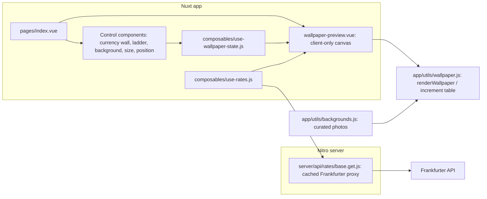

# Technical plan


## Guiding principle

Rebuild and evolve the app on [Nuxt](https://nuxt.com/), the full-stack Vue framework, around one product: a two-currency increment-table wallpaper.
The wallpaper is painted on a `<canvas>` at full device resolution and exported to PNG.
Phase 0 migrated the old Vite prototype (which drew multi-destination cards) into Nuxt. That cards UI is obsolete product direction; later phases replace it with the increment-table layout and the currency-wall selection model defined in [product-spec.md](./product-spec.md).
The product pillars after Phase 0 are: photo backgrounds, the increment-table wallpaper (the only layout), and table positioning.

Target Nuxt 4 (v4.4.x is the current stable at the time of writing; use the latest stable Nuxt 4 release at implementation time). The repo already requires Node >= 24 and pnpm, which satisfies Nuxt's requirements.


## Why Nuxt

* Components and composables replace the manual `getElementById` wiring from the old prototype, so each control (currency wall, ladder inputs, background picker) becomes a small, testable unit.
* Nitro server routes give the app a real backend: `/api/rates/[base]` proxies the Frankfurter API with built-in response caching, instead of an in-memory `Map` in the browser.
* Auto-imports cover components, composables, and utils, so modules stay small without import boilerplate.
* Hybrid rendering: the control panel shell is server-rendered for a fast first paint, while the canvas preview runs client-only where the DOM exists.
* Deployment stays flexible: Nitro presets target Node, Cloudflare, Vercel, and Netlify, and `nuxt generate` can still produce a static export for GitHub Pages.
* The `@vueuse/nuxt` module provides `useLocalStorage` for settings persistence, replacing the manual `loadState` and `saveState` helpers.
* The `@nuxtjs/i18n` module (built on Vue I18n) gives the app an English and Japanese interface with browser-language detection and a persisted language choice.


## Current architecture (after Phase 4)

Phases 0 to 4 are complete. The app lives in the Nuxt layout below and paints a single home/travel increment-table wallpaper with center or left positioning. The interface is available in English and Japanese.

* `app/pages/index.vue`: owns wallpaper state and rates; composes the control panel and preview.
* `app/components/control-panel.vue`, `currency-controls.vue`, `background-picker.vue`, `position-toggle.vue`, `language-switcher.vue`, `wallpaper-preview.vue`: settings column, currency wall plus ladder inputs, photo picker, center/left position, language switcher, and client-only canvas preview with PNG download.
* `app/composables/use-wallpaper-state.js`: persistent settings under `STORAGE_KEY` (`ome-currency-converter:v1`), including `home`, `travel`, ladder fields, and `position`.
* `app/composables/use-rates.js`: fetches from the Nitro rates route for the home currency, with a direct Frankfurter fallback on static hosts; skips fetch when home is unset.
* `app/utils/wallpaper.js`: pure canvas renderer; paints photo or gradient backgrounds and the increment table.
* `app/utils/backgrounds.js`: curated Unsplash photo manifest and CORS-safe image loader.
* `shared/utils/currencies.js`: `CURRENCIES`, `currencyMeta`, and `formatAmount`.
* `shared/utils/ladder.js`: `buildLadder` for home amount rows.
* `shared/utils/currency-selection.js`: `applyCurrencyTap` for the currency-wall state machine.
* `server/api/rates/[base].get.js`: cached Frankfurter proxy.
* `localization/en.json` and `localization/ja.json`: English and Japanese UI strings.

Data flow today: state and rates feed `renderWallpaper`, which paints the canvas at full iPhone resolution. The same canvas is CSS-scaled for the preview and exported to PNG on download. Incomplete home/travel pairs disable download and show an empty state.


## Target architecture




## Project structure

Nuxt 4 uses `app/` as the application source directory, `server/` for Nitro code, and `shared/` for code used by both. Phase 0 mapped the old prototype files as follows (historical reference):

| Former prototype file      | Current location                                      | Notes                                       |
| -------------------------- | ----------------------------------------------------- | ------------------------------------------- |
| `index.html`               | `app/app.vue` + `app/pages/index.vue` + components    | Nuxt generates the HTML document.           |
| `src/scripts/app.js`       | `app/composables/use-wallpaper-state.js` + components | State, persistence, and wiring split apart. |
| `src/scripts/api.js`       | `server/api/rates/[base].get.js` + `use-rates.js`     | Fetch and cache move to the server.         |
| `src/scripts/wallpaper.js` | `app/utils/wallpaper.js`                              | Pure renderer; Phase 2 replaces cards draw. |
| `src/data/currencies.js`   | `shared/utils/currencies.js`                          | Shared by the app and the server route.     |
| `src/styles/styles.css`    | `app/assets/css/main.css`                             | Registered via `css` in `nuxt.config.ts`.   |
| `public/`                  | `public/`                                             | Unchanged.                                  |

Component and composable file names stay `lowercase-with-dashes` per the repository naming rule; Nuxt auto-imports `control-panel.vue` as `<ControlPanel>`.

Application modules stay plain JavaScript to keep diffs small. Nuxt supports this without extra configuration, and TypeScript can be adopted later file by file.


## Rendering strategy

* The app is a single page. `app/pages/index.vue` is server-rendered so the control panel appears immediately.
* The canvas preview lives in `app/components/wallpaper-preview.vue` wrapped in `<ClientOnly>`, because canvas drawing, `localStorage`, and PNG export require the browser.
* `routeRules` in `nuxt.config.ts` prerenders `/` and applies stale-while-revalidate caching to `/api/rates/**`.
* Static export escape hatch: `use-rates.js` falls back to calling Frankfurter directly from the browser when the rates route fails (see the data layer section for the mechanism), so `nuxt generate` output still works on a static host. The API stays keyless and CORS-enabled, so this fallback costs nothing.


## New state shape

State lives in `useWallpaperState`, persisted with `useLocalStorage` under `STORAGE_KEY` (`ome-currency-converter:v1`). Phase 2 replaces the cards-era fields (`base`, `destinations`, `referenceAmount`, `mode`, `travelCurrency`) with home/travel slots and ladder settings:

```js
// app/composables/use-wallpaper-state.js
export const defaultState = {
  home: 'USD', // currency code, or null when cleared
  travel: 'JPY', // currency code, or null when cleared
  step: 5, // ladder step (integer, min 1)
  rowCount: 5, // number of ladder rows (3 to 10)
  includeOne: true, // prepend a 1-unit row when not already present
  theme: 'midnight',
  device: 'pro-max',
  title: 'Travel rates',
  backgroundId: null, // id into backgrounds.js, or null for gradient
  position: 'center', // "center" | "left"
};
```

`home` and `travel` may each be `null` so the UI can hold a partial selection. Preview and download require both to be non-null and different codes.

`useLocalStorage` is configured with `mergeDefaults: true`. On Phase 2 ship, migrate saved cards-era keys when present: map `base` to `home`, map `travelCurrency` (or the first usable entry of `destinations`) to `travel`, and drop `destinations`, `referenceAmount`, and `mode`.

The interface language is not part of this state; `@nuxtjs/i18n` persists the language choice in its own cookie.


## Currency-wall selection model

`currency-controls.vue` presents one chip grid (currency wall). There is no separate Home dropdown. Helpers in the composable or component enforce:

| Current state | User action                            | Result                                   |
| ------------- | -------------------------------------- | ---------------------------------------- |
| Both empty    | Tap code A                             | `home = A`                               |
| Home only     | Tap code B (not home)                  | `travel = B`                             |
| Travel only   | Tap code A (not travel)                | `home = A`                               |
| Both set      | Tap home again                         | `home = null` (travel unchanged)         |
| Both set      | Tap travel again                       | `travel = null` (home unchanged)         |
| Both set      | Tap code C (neither)                   | former travel becomes home; `travel = C` |
| One slot set  | Tap the same code that fills that slot | clear that slot                          |

Selected chips show a home marker or travel marker. The same code cannot occupy both slots.

Rates fetch uses `home` as the Frankfurter base when `home` is set. When only `travel` is set, defer rate fetch until home is chosen (or document an explicit fallback if needed during implementation).


## Ladder logic

Generate the amount ladder from `step`, `rowCount`, and `includeOne`:

```js
// shared/utils/ladder.js
export function buildLadder({ step, rowCount, includeOne }) {
  const rows = [];
  if (includeOne) rows.push(1);
  for (let i = 1; rows.length < rowCount; i++) {
    const value = step * i;
    if (!rows.includes(value)) rows.push(value);
  }
  return rows;
}
// step 5, rowCount 5, includeOne true  ->  [1, 5, 10, 15, 20]
// step 1, rowCount 5, includeOne true  ->  [1, 2, 3, 4, 5] (the duplicate 1 is skipped)
// step 5, rowCount 5, includeOne false ->  [5, 10, 15, 20, 25]
```

Input constraints: `step` is an integer with a minimum of 1, and `rowCount` is an integer clamped to the range 3 to 10 so the ladder always fits the canvas. The UI inputs enforce these bounds, and `buildLadder` clamps its inputs again so the function stays safe when called directly.

Placing `buildLadder` in `shared/utils/` keeps it a pure function that unit tests can import without booting Nuxt.


## Data layer


### `server/api/rates/[base].get.js`

* A Nitro route that proxies `https://api.frankfurter.dev/v1/latest?base=<base>` and returns `{ base, date, rates }`.
* Wrapped in `defineCachedEventHandler` with a one-hour `maxAge` and `staleWhileRevalidate`, since ECB reference rates update once per working day.
* Validates `base` against the shared currency list and returns a 400 error for unknown codes.


### `app/composables/use-rates.js`

* Wraps `useFetch("/api/rates/" + base)` so the page gets rates during server-side rendering and reuses the payload on the client.
* Exposes `refresh()` for the manual refresh button.
* Falls back to a direct browser call to Frankfurter when the server route is unavailable: if the request to `/api/rates/<base>` fails (for example, a static host returns 404 for the route), the composable calls the Frankfurter endpoint directly from the browser and remembers that choice for the rest of the session.


### Currency metadata

* `shared/utils/currencies.js` keeps `CURRENCIES`, `currencyMeta`, and `formatAmount`.
* The currency code list for the wall comes from this static data, with an optional live top-up from `https://api.frankfurter.dev/v1/currencies`.


## Internationalization

The interface supports English and Japanese through the official `@nuxtjs/i18n` module (built on Vue I18n).

* Locales: `en` (default) and `ja`. The `no_prefix` strategy fits a single-screen tool, so the URL does not change per language.
* Language selection: detect the browser language on first visit, persist the choice in a cookie, and let the user switch at any time with a language switcher in the control panel.
* Message files: `localization/en.json` and `localization/ja.json` hold every UI string. English is the source of truth for keys; the module's `langDir` option points at the existing `localization/` folder.
* Terminology and style: Japanese translations follow [glossary.yaml](./glossary.yaml) and the [general style guides](./README.md#general-style-guides).
* Currency names and numbers: use the built-in `Intl.DisplayNames` and `Intl.NumberFormat` APIs with the active locale, so currency names and number formats localize without hand-translated currency metadata.
* Wallpaper text: the renderer stays free of i18n imports. The page passes already-translated strings (the default title, the date label, and the photographer credit prefix) into the render data, so the exported PNG matches the selected language.


## Per-area changes


### New: `app/utils/backgrounds.js` (Phase 1)

* Export `BACKGROUNDS`: an array of curated photo descriptors. See `docs/backgrounds.md` for the field shape and the curated list.
* Export `loadBackgroundImage(id)`: returns a `Promise<HTMLImageElement>`. It sets `img.crossOrigin = "anonymous"` before `img.src` so the drawn canvas stays untainted and exportable. Rejects on error so callers can fall back to a gradient theme.
* Cache loaded `HTMLImageElement`s in a `Map` keyed by id, so switching positions does not refetch the photo. This module is browser-only and is only ever called from client-side components.


### `app/utils/wallpaper.js` (Phase 2 replaces cards draw)

Replace the destination-cards path with the increment-table path. Do not preserve multi-destination cards as a secondary mode.

1. Background: if `data.background` (a loaded image) is present, draw it cover-fit (scale to fill, center-crop) instead of the gradient, then draw a dark scrim gradient over it for text legibility. If no image is present, keep the gradient theme.
2. Legibility scrim: a semi-opaque vertical gradient (darker where the content block sits) so light text stays readable over any photo. When `position` is left, weight the scrim toward the left.
3. Positioning: support `data.position` of `center` or `left`. Center keeps a centered content panel. Left anchors the content block to the left portion of the canvas (roughly the left 55 to 60 percent) and left-aligns text, leaving the right side clear for app icons.
4. Increment table renderer: `renderIncrementTable(ctx, ...)` is the only content layout. It draws a semi-transparent panel matching the hierarchy in [example-wallpaper.png](./example-wallpaper.png): column headers with currency codes (left = home, right = travel), then one row per ladder amount with home amount left and converted travel amount right. Format amounts with currency-appropriate symbols and separators (and compact forms such as `2.0K` when useful for large home steps).
5. Attribution: when a photo background is used, draw a small photographer credit near the bottom edge.
6. Keep `DEVICE_SIZES` and `THEMES` exports; the gradient themes remain the no-photo fallback.
7. Incomplete pair: if `home` or `travel` is missing, or the travel rate is unavailable, do not invent amounts. The preview component shows an empty-state message and disables download instead of calling the table painter with guessed data.

The signature stays `renderWallpaper(canvas, data, size)`; the `data` object carries `home`, `travel`, `ladder`, `rate`, `background`, `attribution`, and `position`. The module stays free of Vue imports so it remains a pure, unit-testable renderer.


### Components

* `app/components/wallpaper-preview.vue`: owns the `<canvas>`, watches the state and rates, calls `renderWallpaper` when the pair is complete, shows an incomplete-pair message otherwise, and handles PNG download via `canvas.toBlob`. Filename pattern: `wallpaper-<home>-<travel>.png`. Wrapped in `<ClientOnly>` by the page.
* `app/components/control-panel.vue`: the settings column, composed of the smaller controls below.
* `app/components/currency-controls.vue`: the currency wall plus step, row count, and include-one inputs. Remove the Home dropdown, destination multi-select, and any cards-only fields such as reference amount.
* `app/components/background-picker.vue` (Phase 1): thumbnail grid built from `BACKGROUNDS`, with a "none" option that falls back to gradient themes.
* `app/components/position-toggle.vue` (Phase 3): center or left.
* `app/components/language-switcher.vue` (Phase 4): toggles the interface between English and Japanese.
* `app/components/attribution-note.vue` (Phase 5): shows the selected photo credit next to the preview.

Do not add `mode-toggle.vue`. There is only one wallpaper layout.


### `app/pages/index.vue`

* Composes the control panel and the preview.
* Calls `useWallpaperState()` and `useRates()` once and passes them down via props or `provide`, keeping a single source of truth.
* Computes render data: `ladder = buildLadder(state)`, rate for `travel` from `rates.value.rates[travel]` when both slots are filled and rates for `home` are loaded.


### `app/assets/css/main.css`

* Keeps the shared panel, field, chip, and button styles.
* Phase 2 adjusts chip selected styles for home versus travel markers.
* Phase 1 adds the background thumbnail grid; Phase 3 adds the position control.
* Scoped styles inside components are allowed for new component-local rules.


### `nuxt.config.ts`

Minimal configuration (already in place from Phase 0):

```ts
export default defineNuxtConfig({
  modules: ['@nuxtjs/i18n', '@vueuse/nuxt'],
  css: ['~/assets/css/main.css'],
  i18n: {
    strategy: 'no_prefix',
    defaultLocale: 'en',
    locales: [
      { code: 'en', language: 'en-US', file: 'en.json' },
      { code: 'ja', language: 'ja-JP', file: 'ja.json' },
    ],
    detectBrowserLanguage: { useCookie: true },
  },
  routeRules: {
    '/': { prerender: true },
    '/api/rates/**': { swr: 3600 },
  },
});
```

The i18n `langDir` option points the module at the `localization/` folder. Treat the snippet as illustrative rather than exact: follow the module documentation for the installed version.


## Tooling and commands

* Runtime dependencies: `nuxt` and `vue`. Dev modules already include `@nuxtjs/i18n`, `@vueuse/nuxt`, and `@vueuse/core`.
* `package.json` scripts (sorted alphabetically): `dev` (`nuxt dev`), `build`, `generate`, `preview`, plus lint and test scripts. See the root `README.md`.
* Prettier, markdownlint, the file name check, and the license check stay as-is.
* Testing uses Vitest with `pnpm test-unit` wired into `pnpm test`.


## CORS and canvas export

* Backgrounds are hotlinked from `images.unsplash.com`, which returns permissive CORS headers (`Access-Control-Allow-Origin: *`). Setting `img.crossOrigin = "anonymous"` before assigning `src` keeps the canvas untainted, so `canvas.toBlob(...)` continues to work for PNG export.
* If a background ever fails to load or is blocked, the renderer falls back to a gradient theme, so download never breaks.
* Rates flow through the Nitro proxy by default, which removes the browser-to-Frankfurter CORS dependency entirely; the static-export fallback still relies on Frankfurter's permissive CORS, which it provides keylessly.


## Phased roadmap

1. Phase 0, Nuxt migration (complete): scaffold Nuxt 4, move the renderer, currency data, and styles into the new structure, rebuild the then-current cards UI as components for feature parity with the Vite prototype, add the rates server route, and confirm preview and PNG download. Set up `@nuxtjs/i18n` and externalize UI strings into `localization/en.json`. Cards parity was a migration checkpoint only; it is not the ongoing product goal.
2. Phase 1, backgrounds module and photo rendering: add `app/utils/backgrounds.js`, wire the background picker, and teach `renderWallpaper` to draw a cover-fit photo with a scrim and attribution. Gradient stays the fallback. Curating the 12 photos follows the proposal and approval flow in [backgrounds.md](./backgrounds.md).
3. Phase 2, increment-table wallpaper (product vision): remove multi-destination cards from state, UI, and renderer. Add the currency-wall home/travel selection model, step and row count controls, `shared/utils/ladder.js`, and `renderIncrementTable`. Incomplete pairs disable download and show an empty state. This phase ships the only supported wallpaper layout.
4. Phase 3, positioning: add the center or left control and update the renderer to anchor and align the content block, weighting the scrim accordingly.
5. Phase 4, Japanese localization: translate `localization/en.json` into `localization/ja.json` following [glossary.yaml](./glossary.yaml) and the Japanese general style guide, add the language switcher, localize currency names and number formats through the `Intl` APIs, and verify the wallpaper renders correctly in both languages.
6. Phase 5, polish and deployment: attribution UI, responsive control layout, empty and error states, a legibility pass across all curated photos, and picking the Nitro deployment preset (or `nuxt generate` for a static host).


## Testing notes

* Unit tests (Vitest): `buildLadder` (including the duplicate-1 skip and the step and row count clamps), currency-wall selection transitions (home-only, travel-only, re-tap, rotate on third tap), `formatAmount`, and the rates route handler with a mocked Frankfurter response.
* Component tests (`@nuxt/test-utils`): currency controls enforce at most two selected roles; preview disables download when the pair is incomplete; background picker falls back to gradient on load failure.
* Manual checks:
  * Verify PNG export works with a photo background selected (canvas not tainted).
  * Verify each iPhone size renders the increment table without clipping.
  * Verify left position leaves the right portion of the wallpaper clear for app icons.
  * Verify the app still loads and renders if the rate API or a background image fails.
  * Verify incomplete home/travel selection never invents a partner currency on the canvas.
* Verify the interface and the generated wallpaper render correctly in both English and Japanese, including longer Japanese labels fitting the control layout and the canvas.
* Verify the `nuxt generate` static export still fetches rates via the client fallback.
